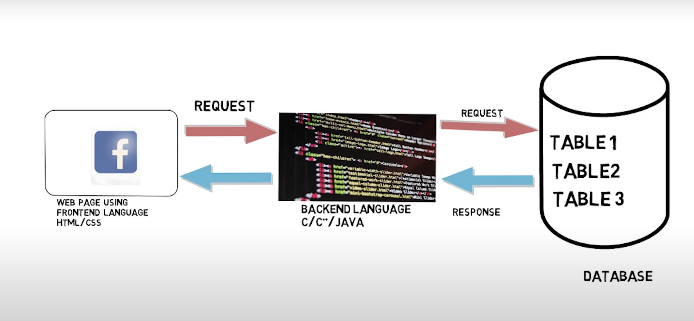

# Introduction of Oracle SQL

SQL is a standard language for storing, manipulating and retrieving data in databases.

Our SQL tutorial will teach you how to use SQL in: MySQL, SQL Server, MS Access, Oracle, Sybase, Informix, Postgres, and other database systems.

# RDBMS

RDBMS stands for Relational Database Management System.

RDBMS is the basis for SQL, and for all modern database systems such as MS SQL Server, IBM DB2, Oracle, MySQL, and Microsoft Access.

The data in RDBMS is stored in database objects called tables. A table is a collection of related data entries and it consists of columns and rows.

# Where data base is used ?

  

# Types of databases
- Relational Database Management System
- NOSQL Database Management System

# NOSQL database management system

## Managing refers to storing permanently and retrieving efficiently
1. How to store data(small volumes of facts) permanently and how to retrieve (get the stored facts) efficiently?

2. How to store database(large volumes of facts) permanently and how to retrieve (get the stored large volumes of facts) efficiently ?